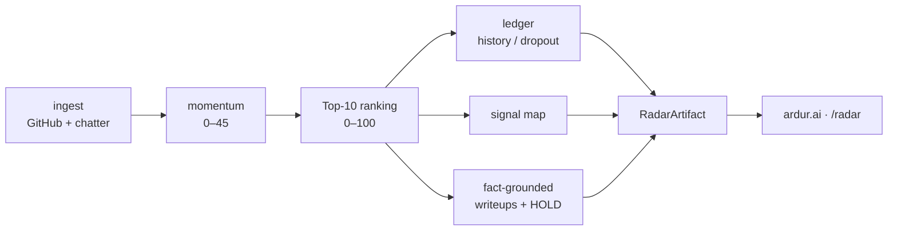

# ardur-radar-engine

**The standalone OSS RADAR engine for [ardur.ai](https://github.com/ArdurAI/ardur.ai).**
Holds the whole Radar pipeline in one repo — GitHub + chatter ingestion, momentum
signals, Top-10 OSS ranking, a persisted rank-history ledger, the Signal Map graph,
and fact-grounded AI-primary project writeups — and emits a single versioned
`RadarArtifact` that `/radar` consumes.

> Schema **`ardur-radar/v1`** · Contracts **`@ardurai/contracts` Rev 3** · Node ≥ 22 · TypeScript (strict) · MIT
>
> This is the **active** engine for the Radar section, a peer to the news engine
> family (`ardur-news-aggregator` → `ardur-ranking-engine` → `ardur-top10-engine` →
> `ardur-article-synthesizer`) but scoped to Radar only. It **ports** the proven
> in-`ardur.ai` OSS RADAR logic (epic [#124](https://github.com/ArdurAI/ardur.ai/issues/124),
> issues #125–#132) — formula for formula — rather than reinventing it. See
> [`docs/spec.md`](./docs/spec.md) for the full design, the formula port, and the
> staged `/radar` cutover (tracker [ardur.ai#135](https://github.com/ArdurAI/ardur.ai/issues/135)).

## What it does



- **Deterministic / zero-cost by default.** No GitHub token, no chatter flags, no
  model key → a complete, reproducible artifact. The whole CI runs this path.
- **Cost-guarded, pluggable AI.** Writeups use a `deterministic | ollama | openai`
  provider (Ollama local-first), budget- and timeout-guarded. AI-primary: a writeup
  is **held**, never flat-published, when AI is unavailable or a claim isn't grounded.
- **Fact-grounded, copyright-safe.** Every writeup claim maps to a project signal
  fact (real GitHub adoption/recency/license metadata) with provenance links; short
  quotes only; credential screen. Reuses the news synthesizer's patterns.
- **Agent-ready.** JSON-in / JSON-out CLI with `--in` / `--out` / `--now` /
  `--describe`, JSON errors on stderr, and a tool manifest for the Hermes agent layer.

## Quickstart

```bash
npm install

# deterministic, zero-network cycle → artifact on stdout
npm run radar -- --now 2026-06-11T06:00:00Z --out radar.json

# print the agent tool manifest
npm run describe

# live GitHub ingestion (raises rate limits; still no model calls)
GITHUB_TOKEN=… npm run radar -- --out radar.json

# opt a chatter platform + a local model into the cycle
ARDUR_OSS_FETCH_HN=1 ARDUR_AI_PROVIDER=ollama npm run radar -- --out radar.json
```

Thread the previous artifact to accumulate ledger history / dropout:

```bash
npm run radar -- --in radar.prev.json --out radar.json
```

## CLI

| Flag | Arg | Purpose |
|---|---|---|
| `--in` | path | previous `RadarArtifact` (ledger history / dropout continuity) |
| `--out` | path | write the artifact (default: stdout) |
| `--now` | iso | pin the clock for deterministic replay |
| `--describe` | — | print the tool manifest (JSON) and exit |

Errors are emitted as a single JSON object on **stderr** with exit code 1.

## Scripts

| Script | Purpose |
|---|---|
| `npm run radar` | run a single radar cycle (stdout) |
| `npm run cycle` | run a cycle and write `manifest.json` + `latest/radar.json` to `RADAR_OUTPUT_DIR` |
| `npm run describe` | print the tool manifest |
| `npm run build` | `tsc` → `dist/` |
| `npm run typecheck` | `tsc --noEmit` |
| `npm test` | node:test smoke suite |
| `npm run lint` / `format:check` | eslint / prettier |

## Hosting the 6h cycle

`npm run cycle` is the cron entry point. It reads the previous artifact from
`$RADAR_OUTPUT_DIR/latest/radar.json` (if it exists) as `--in` to accumulate
ledger history, runs the pipeline, and writes atomically:

```
$RADAR_OUTPUT_DIR/
  latest/radar.json   ← current artifact (atomic rename from tmp/)
  manifest.json       ← last-good-wins pointer (written only on success)
  tmp/                ← staging area (cleaned after rename)
```

Cron (UTC-aligned, every 6h):

```cron
0 */6 * * *  cd /path/to/ardur-radar-engine && RADAR_OUTPUT_DIR=/data/radar GITHUB_TOKEN=... npm run cycle 2>>cycle.log
```

All output goes to stderr as newline-delimited JSON (`{"ts":"…","level":"info","event":"cycle.ok",…}`).
The manifest is only updated after a successful write, so `latest/radar.json` always
points to the last good artifact even if a cycle fails mid-way.

## Configuration

See [`.env.example`](./.env.example). Highlights: `ARDUR_AI_PROVIDER`,
`ARDUR_AI_MAX_GENERATIONS`, `OLLAMA_HOST`/`OLLAMA_MODEL`, `OPENAI_API_KEY`,
`GITHUB_TOKEN`/`GH_TOKEN`, and the per-platform `ARDUR_OSS_FETCH_*` chatter flags
(all off by default).

## Layout

`src/` mirrors the pipeline (`ingest/`, `momentum`, `ranking`, `ledger`,
`signal-map`, `writeup/`, `pipeline`, `cli`); `legacy/` preserves the original
dormant Python sketch for reference; `docs/spec.md` is the canonical design.

## License

MIT © 2026 ArdurAI
