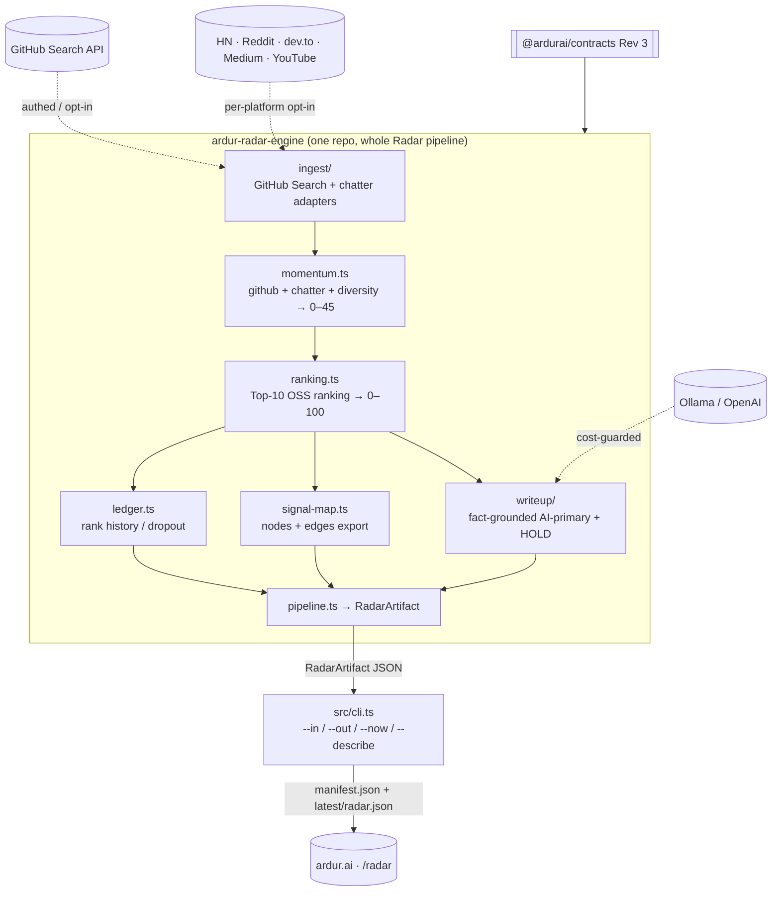
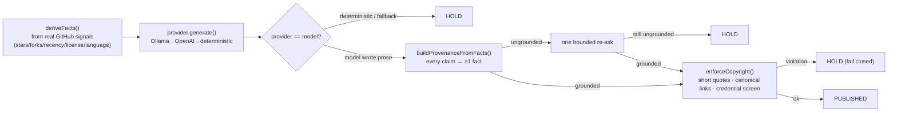
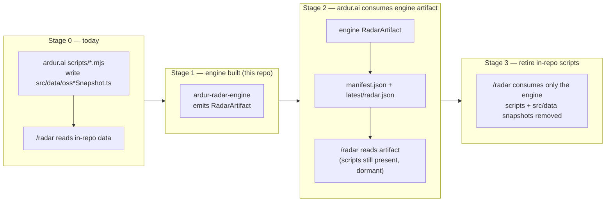

# ardur-radar-engine — Engine Specification

> **Status: ACTIVE.** This is the real standalone engine for the ardur.ai **OSS RADAR**
> section. It is treated exactly like the news engine family (`ardur-news-aggregator`,
> `ardur-ranking-engine`, `ardur-top10-engine`, `ardur-article-synthesizer`) but is
> scoped to Radar only and holds the **whole Radar pipeline in one repo**.
>
> Schema: **`ardur-radar/v1`** · Contracts: **`@ardurai/contracts` Rev 3** · Node ≥ 22 · TypeScript (strict) · MIT

---

## 1. Why this engine exists

The OSS RADAR shipped first as a set of `.mjs` scripts **inside** `ardur.ai`
(epic [#124](https://github.com/ArdurAI/ardur.ai/issues/124), issues #125–#132).
That logic is proven in production. This engine **ports** that logic — formula for
formula — into a standalone, typed, agent-ready engine so that:

- Radar lives next to the news engines as a peer artifact producer, not as build-time
  scripts welded into the site.
- The site stops owning data logic and instead **consumes a versioned artifact**
  (mirroring the news INTEG pattern: `manifest.json` + `latest/`).
- The engine is **agent-ready** (`--describe` tool manifest, JSON I/O, deterministic
  replay) so the Hermes agent layer can drive it at gates.

The engine **does not reinvent** the ranking/momentum/ledger model — it reproduces
the in-ardur.ai math exactly (see §4). The in-ardur.ai scripts keep running until the
staged cutover (§8) completes; **no downtime**.

---

## 2. Architecture



**One process, six stages.** Unlike the news pipeline (four repos orchestrated by
`ardur-pipeline`), Radar is small and tightly coupled, so it lives in one engine.
The CLI runs the whole cycle and emits one `RadarArtifact`.

**Deterministic by default.** With no GitHub token, no chatter flags, and no model
key, the engine produces a complete, valid, reproducible artifact (empty or
seed-backed). CI runs this path.

---

## 3. OSS data sources & ingestion

### 3.1 GitHub (primary) — `src/ingest/github.ts`

Allow-listed GitHub Search topic queries per category. Categories (ported from the
in-ardur.ai allow-list): **AI, Kubernetes, Cloud Native, Quantum Tech, Software
Engineering**. Each category carries several `topic:… stars:>N archived:false`
queries.

| Concern | Behavior |
|---|---|
| Auth | `GITHUB_TOKEN` / `GH_TOKEN` (30 req/min authed vs 10 anon) |
| Live gate | fetches only if a token is present **or** `ARDUR_OSS_FETCH_GITHUB=1`; else empty + warning |
| Rate pacing | `ARDUR_GITHUB_SEARCH_DELAY_MS` between queries |
| Bounds | 4 MB response ceiling, `per_page=20`, `sort=stars` |
| Output | `RadarProject[]` deduped by lowercase `full_name`, ranked by `repoScore` |

### 3.2 Chatter (opt-in) — `src/ingest/chatter.ts`

Six platform adapters, **all off by default** (deterministic builds). Each opts in
via its own flag and contributes a bounded 0–15 score.

| Platform | Flag | Endpoint | Notes |
|---|---|---|---|
| Hacker News | `ARDUR_OSS_FETCH_HN` | hn.algolia.com | story search |
| Reddit | `ARDUR_OSS_FETCH_REDDIT` | reddit.com/search.json | relevance |
| dev.to | `ARDUR_OSS_FETCH_DEVTO` | dev.to/api/articles | by tag |
| Medium | `ARDUR_OSS_FETCH_MEDIUM` | medium.com/feed/tag | RSS |
| YouTube | `ARDUR_OSS_FETCH_YOUTUBE` | youtube/v3/search | needs `YOUTUBE_API_KEY` |
| X/Twitter | `ARDUR_OSS_FETCH_X` | — | stubbed (paid API) |

Every adapter fails closed to an `unavailable` result; the network is touched only
through the single `boundedText` seam (256 KB ceiling).

---

## 4. Momentum & ranking model (ported verbatim)

### 4.1 Momentum — `src/momentum.ts` (0–45)

```text
githubMomentum   = min(18, log10(stars+1)*5) + min(8, log10(forks+1)*3)
                 + (age≤14d ? 8 : age≤45d ? 5 : age≤120d ? 2 : 0)        # clamp 25
chatter          = Σ platform scores                                      # clamp 90
diversityBonus   = min(10, 2 * #real-platforms)
momentum         = clamp(githubMomentum + chatter + diversityBonus, 45)
```

### 4.2 Top-10 ranking — `src/ranking.ts` (0–100)

`weightConfig = oss-ranking-v1` → adoption **35** · momentum **25** · recency **20** ·
credibility **20**.

```text
githubAdoption   = clamp(min(22, log10(stars+1)*8) + min(8, log10(forks+1)*4) + (license?5:0), 35)
crossPlatform    = clamp(momentum/45 * 25, 25)
recency          = age≤7d?20 : ≤30d?16 : ≤90d?10 : ≤180d?5 : 2
credibility      = clamp(min(8, sourceCount*4) + min(6, #topics) + (high?6:medium?3:0), 20)

score = githubAdoption + crossPlatform + recency + credibility
if (!license)            score = min(score, 82)   # integrity cap
if (confidence==='watch')score = min(score, 78)   # integrity cap
score = clamp(score, 100)
```

Sort: **score DESC, then `fullName` ASC** (stable tiebreak). Top 10 ranked `1..10`.

Confidence (`high` / `medium` / `watch`) is a 6-signal vote: stars≥5000, forks≥250,
pushed≤45d, license known, topic match, source count > 0.

---

## 5. Ledger — `src/ledger.ts`

Persisted rank-history ledger (`oss-radar-ledger/v1`), threaded from the previous
`RadarArtifact` (`--in`). Per tracked project: `firstSeen`, `lastSeen`, `droppedAt`,
`articleStatus`, and a **40-entry sliding window** of `{rank, score, seenAt}`.
Projects absent from the current Top-10 get `droppedAt` set; re-entry clears it.
`stats` summarizes tracked / active / dropped / published counts.

---

## 6. Signal Map — `src/signal-map.ts`

Node/edge knowledge graph over the Top-10 (`oss-signal-map-export/v1`):

- **Nodes**: `project` (10) · `category` · `owner` · `language` · `topic` (≤4/project) · `platform-source`.
- **Edges**: `same-category` (0.9) · `same-org` (0.75) · `shared-topic` (0.7) ·
  `shared-language` (0.6) · `cluster` (0.55, project↔project in a category) ·
  `co-mention` (0.4, project↔platform).
- Node ids are content-addressed: `<type>:<10-char base64url sha256>`.
- `layout.rings` (core / taxonomy / chatter) + `rankedList` drive the visualization.

---

## 7. Writeup synthesis — `src/writeup/`

**Fact-grounded, AI-primary, with HOLD** — reuses the news synthesizer's provider,
provenance, and copyright patterns.



- **Facts come from the project's own signals** — real GitHub adoption/recency/
  license/language metadata, carried as `ProjectSignalFact` with `provenance[].url`.
  Never an assumption-y paraphrase. (Extension point: also read releases/README.)
- **AI-primary**: a deterministic result is **held**, never flat-published. On the
  default zero-cost path every writeup is `held` — exactly mirroring the news
  synthesizer's behavior when AI is unavailable.
- **Provider** (`src/writeup/provider.ts`): `deterministic | ollama | openai`,
  cost-guarded (`ARDUR_AI_MAX_GENERATIONS`, `ARDUR_AI_TIMEOUT_MS`), Ollama
  local-first (cloud only with `OLLAMA_API_KEY`). A provider **never rejects** —
  every failure resolves to the deterministic fallback and the synthesizer decides.

---

## 8. Contracts usage & agent-readiness

### 8.1 Contracts (Rev 3)

The engine consumes `@ardurai/contracts` (git-dep, pinned to the same commit the
news engines use) for shared primitives: `Confidence`, `CycleMeta`, `ProviderMeta`,
`SourceRef`, `ExtractedFact`/`FactProvenance`/`ClaimProvenance`, and
`assertCompatibleArtifact`. Radar is a **parallel** pipeline, so it stamps its own
`schemaVersion: 'ardur-radar/v1'` while carrying `contractRevision: 3` for the
shared primitives.

### 8.2 Agent-ready CLI

```text
cli.ts                              run a cycle → RadarArtifact on stdout
cli.ts --out radar.json             write the artifact to a file
cli.ts --in prev.json               thread the previous artifact (ledger continuity)
cli.ts --now <iso>                  pin the clock for deterministic replay
cli.ts --describe                   print the tool manifest (JSON) and exit
```

- **JSON-in / JSON-out** on stdout; **errors as one JSON object on stderr** + exit 1.
- `--describe` emits a tool manifest (name, contractRevision, flags, env, idempotency,
  `stateless`) modeled on `ardur-pipeline/docs/tool-manifests/*.json`.
- **Idempotency = cycle**: a run is fully determined by `(now, env, previous)`; no
  `Date.now()`/`Math.random()` leaks into scoring.

---

## 9. Migration & /radar cutover (STAGED, no downtime)

The cutover mirrors the news INTEG pattern. **Nothing is deleted from ardur.ai until
the engine is proven in production.**



### Field/shape mapping (in-ardur.ai → engine)

| in-ardur.ai script / file | engine module | artifact field |
|---|---|---|
| `refresh-open-source-radar.mjs` → `openSourceRadarSnapshot.ts` | `ingest/github.ts` | `data.projects`, `data.coverage`, `data.categories` |
| `oss-momentum-signals.mjs` → `ossMomentumSnapshot.ts` | `momentum.ts` + `ingest/chatter.ts` | `data.momentum` |
| `oss-ranking.mjs` (`topTenSignals`) | `ranking.ts` | `data.topTen` |
| `oss-radar-ledger.mjs` → `ossRadarLedgerSnapshot.ts` | `ledger.ts` | `data.ledger` |
| `build-oss-signal-map*.mjs` → `ossSignalMapExportSnapshot.ts` | `signal-map.ts` | `data.signalMap` |
| (new) fact-grounded writeups | `writeup/synthesize.ts` | `data.writeups` |
| `evaluate-oss-engine.mjs` | `npm test` + schema gates | — |

### Cutover steps

1. **Stage 1 (this repo).** Build + CI green; engine emits `RadarArtifact`. ✅ here.
2. **Stage 2 (ardur.ai).** Add an adapter that reads the engine artifact
   (`latest/radar.json`) and feeds the existing `/radar` components from
   `data.topTen` / `data.signalMap` / `data.ledger` / `data.writeups`. Keep the
   `.mjs` scripts in place but **dormant** (feature-flag the source). Verify
   parity (same Top-10 ordering, same ledger) on a real cycle.
3. **Stage 3 (ardur.ai).** Once parity holds for N cycles, remove
   `scripts/*oss*.mjs` and the generated `src/data/oss*Snapshot.ts`; `/radar`
   consumes only the engine artifact. The Radar content collection
   (`src/content/radar`) is sourced from published (non-held) writeups.
4. **Pipeline host.** Either `ardur-pipeline` spawns this engine on the 6-hour
   cycle (as it does the news engines) or a dedicated radar cron does; both write
   `manifest.json` + `latest/` for the site to consume.

---

## 10. Testing & determinism

`npm test` (node:test, strip-types) covers the ported math (repoScore, confidence,
momentum clamp, ranking caps, top-10 ordering), the ledger (first-seen / dropout /
window), the signal map, provenance grounding, copyright screening, provider HOLD vs
publish, and a full offline pipeline run. CI also runs `format:check`, `lint`,
`typecheck`, and `build` on the zero-cost deterministic path.

---

## 11. Repository layout

```
src/
  cli.ts                 agent-ready CLI (--in/--out/--now/--describe, JSON errors)
  index.ts               public API
  manifest.ts            --describe tool manifest
  contracts.ts           @ardurai/contracts re-exports + RadarEnvelope
  types.ts               radar domain types
  clock.ts               deterministic clock + 6h cycle alignment
  util.ts                clamp / log10p1 / stableId / boundedText / env helpers
  pipeline.ts            orchestrates all stages → RadarArtifact
  ingest/
    github.ts            GitHub Search ingestion, repoScore, confidence
    chatter.ts           env-gated platform adapters
  momentum.ts            momentum scoring
  ranking.ts             Top-10 ranking + integrity caps
  ledger.ts              rank history / dropout
  signal-map.ts          node/edge graph + export
  writeup/
    provider.ts          pluggable cost-guarded AI provider
    copyright.ts         provenance gate + copyright/credential screen
    synthesize.ts        fact-grounded AI-primary writeups + HOLD
  smoke.test.ts          node:test suite
legacy/                  the original dormant Python sketch (reference only)
docs/spec.md             this document
```
